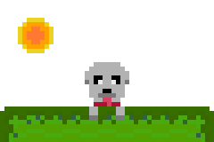

# Meerkat Engine
Just a hobby game engine (WIP)

## About
A game engine project with ecs at it's core (found in `/Core`).

## Dependencies
* `cc` - Any C compiler supported by premake (`#pragma once` support also required)
* `deno` - Used in various parts of the engine build system
* `imagemagick` - Used for image manipulation
* `premake5` - Used to generate makefiles
* `sdl2` - Used in the graphics api
    * `sdl2-image v2.6+` - QOI Images

## Building
Ensure `premake5` is installed along with the development tools for your specific platform.

### Desktop
Refer to the `premake5` [manual](https://premake.github.io/docs/Using-Premake).
